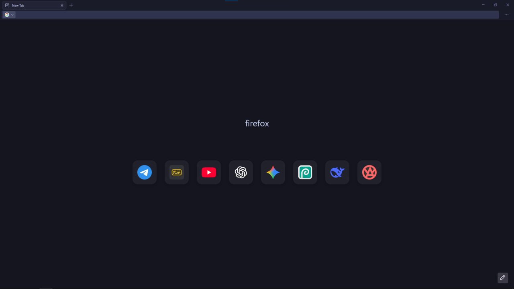

# fox-den

minimalist firefox setup. no clutter, just web. based on edge-frfox.

### key changes
* **cleaner about:newtab**: removed all bloated logos and labels. replaced with a simple "firefox" text string.
* **dock-style dashboard**: top sites are transformed into sleek tiles with hover animations and no text labels.
* **distraction-free ui**: all navigation buttons (back/forward/home) are hidden. rely on your mouse side buttons or alt + arrow shortcuts.
* **system-wide aesthetics**: thin, dark scrollbars that blend perfectly with a catppuccin or dark system theme.

### how to install
1. install the base: [edge-frfox](https://github.com/bmFtZQ/edge-frfox)
2. download `userChrome.css` and `userContent.css` from the latest release of this repo.
3. find your profile folder:
   * open `about:support` in firefox.
   * look for **profile folder** and click **open folder**.
   * if `chrome` doesn't exist, create a folder with that name.
5. extract/place both `.css` files into the `chrome` folder.
6. restart firefox and enjoy.

---
*part of the dekabrskuy reliability & automation stack.*

### 🖼 preview

*minimalist dashboard with dock-style icons and custom branding.*
*tokyo night moon theme set and customized toolbar*
